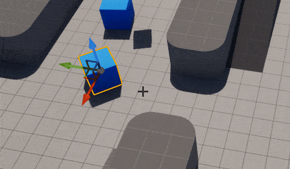
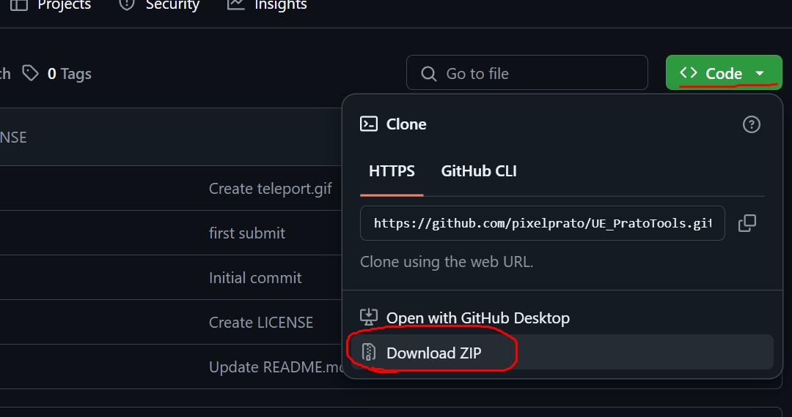
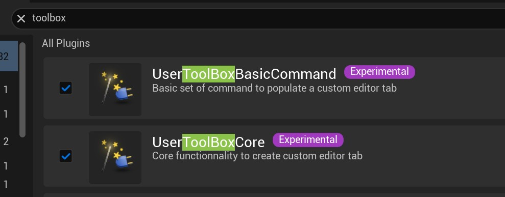
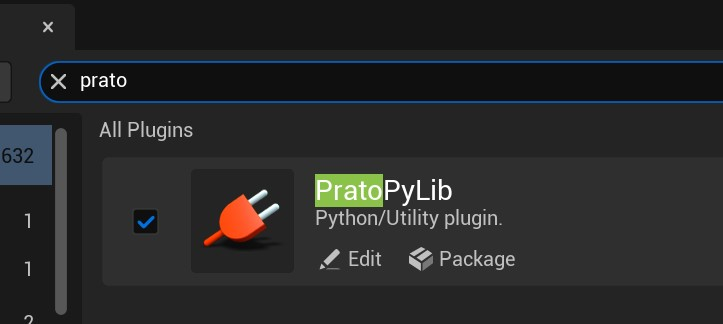
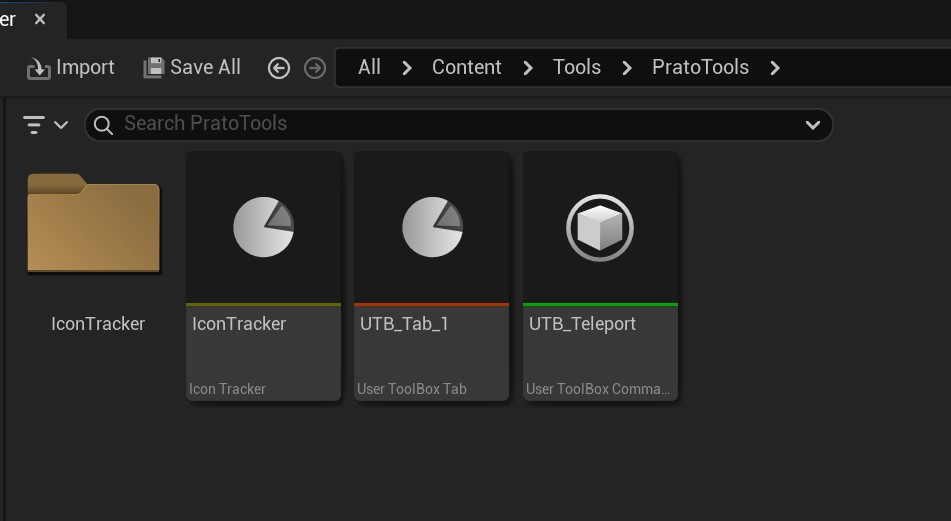
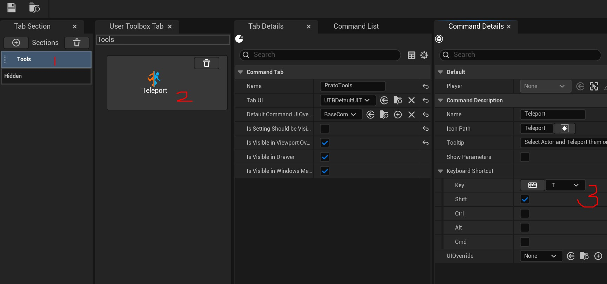
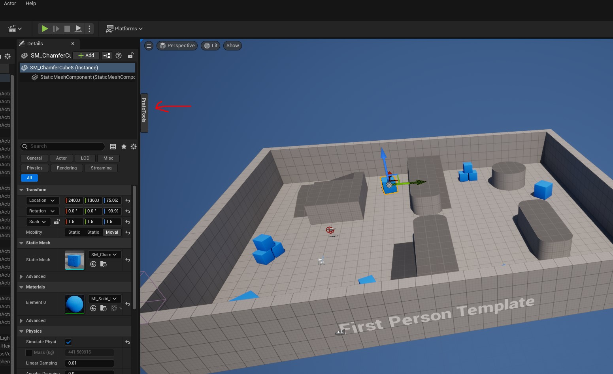

# Pixel-Prato Unreal Editor Tools

## Table of Contents

- [Tools](#tools)
- [Install](#install)
- [Version](#version)
- [Details](#details)

# Tools
The only tool for the moment is
- a __Teleport__:
  - You select an actors place your cursor elsewhere and press Shift+T to teleport!
  - 

I had to extend Python with a little C++ function to get the mouse position in world from the viewport/camera. All the rest of the logic is done in Blueprint(Toolbox class).

# Version

This toolset contains a small Python librairy built with Unreal Editor __5.5.4__.
Source is there anaway, build it with your preferable version or ask if you want other version built, I can help.

# Install

Download and unzip.
 

Copy paste __*Content*__ & __*Plugins*__ folders in your Unreal Project. 
Re-open your project and verify that you have ToolBox of Unreal checked and my PratoPyLib in __*Edit / Plugins*__.

# Details

This blueprint is a Toolbox class. New tool feature arrived recently around 5.2 UE. Beaware that changing blueprint sometimes can crash Unreal, save twice like. 

You can browse the "toolbox" tab element under Content/Tools/PratoTools/UTB_Tab_1.
 

There's only one tab with one tool UBT_Teleport(1,2).
The powerful feature I found from this Unreal Toolbox is that __you can assign shortcuts__ without the need of coding C++ (3).
 

You can enable the display of the tab from __drawer__ or __viewport-frame(Viewport Overlay)__
 
 __warning__:If you uncheck the viewport one, no more shortcut will work, sadly.

